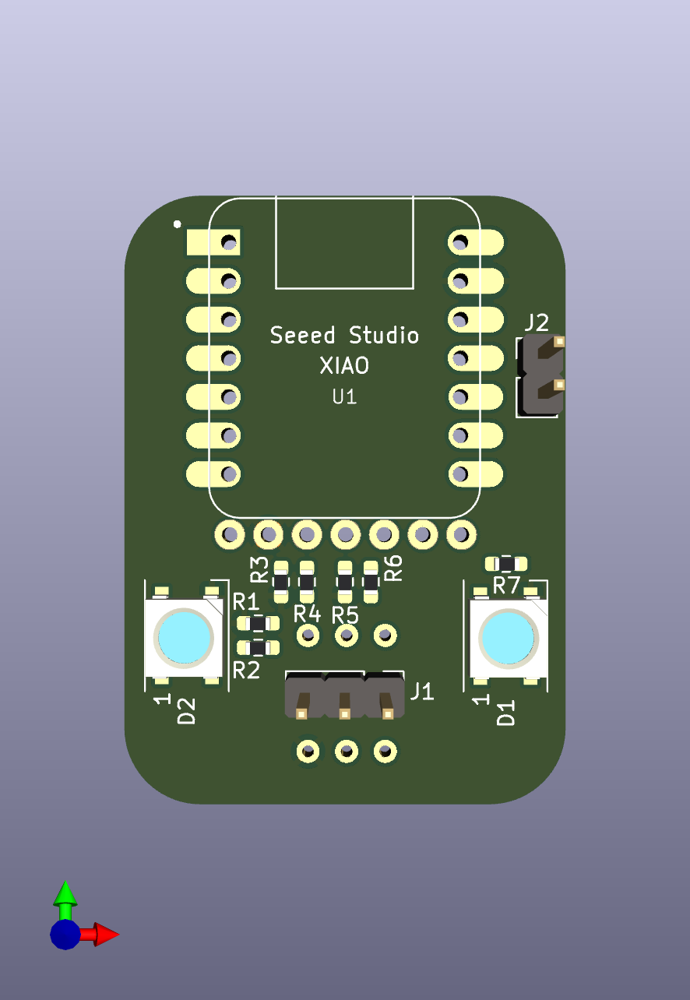
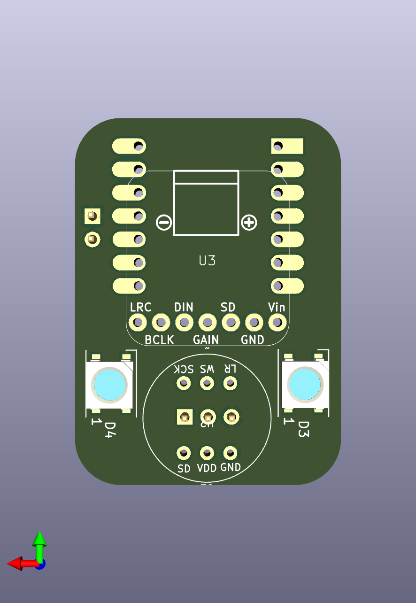

# BottleNode
#### An interactive network node for immersive experiences built around a Seeed Studio XIAO ESP32-S3

This repository contains the design and code for the BottleNode project. The project is structured into two main directories:

- `AllInOne_test`: This directory contains an Arduino program to test the BottleNode hardware. You will want to install the following Arduino libraries using the Library Manager (`Sketch` -> `Include Library` -> `Manage Libraries...`):
	* `Adafruit NeoPixel` (by Adafruit)
	* `LiteLED` (by Xylopyrographer)
	* `OSC` (by Adrian Freed)
	* `WS2812FX` (by Harm Aldick)

- The program also depends on the [ESP32-audioI2S library](https://github.com/schreibfaul1/ESP32-audioI2S), which you can install in the Arduino IDE by following these steps:

 	1. Download the latest release as a .zip from the repo `Releases` page [(link)](https://github.com/schreibfaul1/ESP32-audioI2S/archive/refs/tags/3.0.0.zip)
	2. Click on `Sketch` -> `Include Library` -> `Add .ZIP Library...` to add the library to your environment.
	
- `hw/BottleNode`: This directory contains the KiCAD project and associated files for the hardware design of the BottleNode. It includes 3D renderings of the board as PNG images and a PDF schematic of the board. You can view the schematic [here](hw/BottleNode/BottleNode%20schematic.pdf).

	Renderings of the top and bottom of the PCB:

	 
